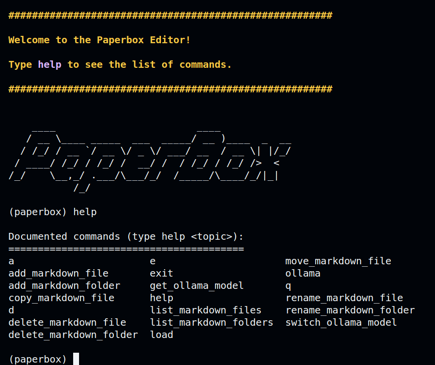

# Welcome to PaperBox [Functional, Early Development] 📦

## What is PaperBox?

PaperBox is a command line tool that allows you to take notes in plain english, shorthand, or whatever's quickest. It uses LLMs to translate your work to beautiful markdown in real time. Paperbox even understands math described in english - it renders it directly in the markdown document in LaTeX. PaperBox is built on top of [Ollama](https://github.com/jmorganca/ollama), using custom LLMs to translate between natural language and any renderable scripting language.

## PaperBox Early Stage Tutorial

0. It is recommended you use VSCode for the early version of PaperBox. It supports live markdown previewing until PaperBox may or may not add live server (who knows?).
1. Install [Ollama](https://github.com/jmorganca/ollama)
   ```
   https://github.com/jmorganca/ollama
   ```
1. If you wish to use the defualt model (recommended for best performance), run the following. Otherwise, swap this for the model you want to use from ollama:

   ```
   ollama pull mistral-openorca
   ```

   - NOTE: if you choose to use a different model, make sure when you start the cli to run the following command:
     ```
     switch_ollama_model <model_name>
     ```

1. Clone the repo
   ```
   git clone https://github.com/Ryguy-1/paperbox.git
   ```
1. Install the dependencies
   ```
   pip install -r requirements.txt
   ```
1. Run the program
   ```
   python cli.py
   ```
1. Use the help command to get started!
   

1. (I have found VSCode side-by-side preview view to be incredibly quick using PaperBox. It will render the markdown live for you, and, if PaperBox fails something you wish to edit quicker by hand, you can do so and ask PaperBox to reload the file.)
